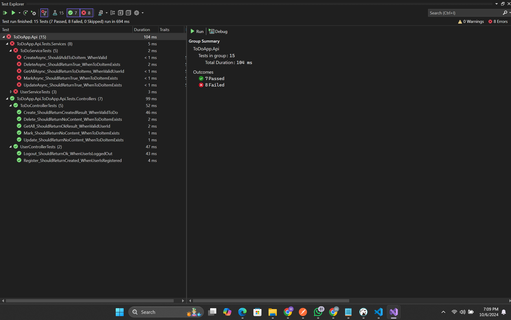

# ToDoApp

## Table of Contents
1. [Introduction](#introduction)
2. [Prerequisites](#prerequisites)
3. [Database Migration and Update](#database-migration-and-update)
4. [Setting Up the Project](#setting-up-the-project)
5. [How To Used Application](#how-to-used-application)
5. [Functional Requirements](#functional-requirements)
6. [Technical Requirements](#technical-requirements)
7. [Docker Setup](#docker-setup)
8. [Running the Application](#running-the-application)
9. [Unit Testing](#unit-testing)
10. [Error Handling and Logging](#error-handling-and-logging)
11. [Contributing](#contributing)
12. [License](#license)

## Introduction
This repository contains a To-Do application built with ASP.NET Core 8.0, Blazor for UI and Entity Framework Core, utilizing SQLite for the database. The application allows users to register, log in, and manage their To-Do activities efficiently.


## Prerequisites
- [.NET 8.0 SDK](https://dotnet.microsoft.com/download/dotnet/8.0)
- [Docker](https://www.docker.com/products/docker-desktop)
- A code editor (e.g., [Visual Studio Code](https://code.visualstudio.com/))

## Database Migration and Update
To migrate and update the database, follow these steps:

1. Open a terminal and navigate to the project directory.
2. Run the following command to apply any pending migrations:

   ```bash
   dotnet ef database update

3. Open a DbEaver or any for setup database, select SqlLite, set file in directory project ToDoApp.Api/todo.db

## Setting Up the Project
1. Clone this Project 
    '''bash
    https://github.com/maul97siregar/ToDoApps.git

2. Open Project.sln in your Visual Studio 2022
3. You can start this application with two options, Via Docker or Local

### Option 1 : Running Via Docker
1. open your terminal, and command
   ```bash
   docker-compose up --build

   

### Option 2: Running Locally
1. Open Visual Studio 2022 and load the `Project.sln` solution file.
2. Set the startup project item, you can run multiple startup for API and UI or can different winndow:
   - Right-click on the project you want to run (usually the API project) in the Solution Explorer.
   - Select **Set as Startup Project**.

3. Configure the application settings:
   - If necessary, update any configuration settings in the `appsettings.json` file to match your local environment.

4. Start debugging:
   - Press `F5` to start debugging the application. This will compile the project and launch it in your default web browser.
   - Alternatively, you can run the application without debugging by pressing `Ctrl + F5`.

5. Use the application:
   - You can register a new user, log in, and manage To-Do activities as per the functional requirements.

## How To Used Application
    Every panel list, for response time if any 10 million data, we have used pagination and every panel limit 5 data. You can next page or previous

## ScreenShoot
1. Register
    - For root pages is logi, you can click register below button SIGN IN
    - Input UserId, Name, and Password 
    ()
    - If Success, automated open page Login

2. Login
    - Input UserId and Password
    

3. Home View
    - After Login, you can view Home for ToDo List and panel group by status
        

4. Edit Status
    - Add ToDo (Please check blocked cursor, the new data)
        

    - Edit Status from panel UnMark
        

        result edit UnMark
        
    
    - Note* You can reverse status realtime, unmark to done, done to cancel, cancel to unmark or any

## Functional Requirements

### User Module
- **User Registration**: 
  - Users can register by providing a user ID, password, and name. This information is stored securely in the database.

- **User Login**: 
  - Users can authenticate themselves using their user ID and password before accessing their To-Do activities. Successful authentication grants access to the application features.

### To-Do Module
- **To-Do Creation**: 
  - Users can create multiple To-Do items by inputting a subject and description. Each To-Do item is assigned a unique sequential activity number in the format `AC-XXXXXX`, which is stored in the database.

- **To-Do List**: 
  - Users can view a comprehensive list of their To-Do activities. This list displays all items associated with their user account.

- **To-Do Marking**: 
  - Users can mark their To-Do activities as Done or Canceled. Additionally, they can reverse the status of any item back to Unmarked.

- **To-Do Modification**: 
  - Users are able to modify the subject and description of any unmarked To-Do activities, allowing for updates and corrections.

- **To-Do Deletion**: 
  - Users can delete any unmarked To-Do activities they no longer wish to keep, ensuring their To-Do list remains relevant and manageable.

## Technical Requirements

1. **ASP.NET Core 8.0**: 
   - The application is developed using ASP.NET Core 8.0, leveraging its robust features for building modern web applications.

2. **UI Framework**: 
   - For the user interface, I used Blazor

3. **Entity Framework Core**: 
   - Data access is managed using Entity Framework Core, an ORM that simplifies database operations. The application uses SQLite as the database for its lightweight and file-based storage capabilities.

4. **Error Handling and Logging**: 
   - The application implements proper error handling and logging mechanisms to capture and log errors gracefully, ensuring that users receive meaningful feedback without exposing sensitive information.
     

     

5. **Unit Testing**: 
   - Comprehensive unit test scripts are written to ensure the functionality of the application. These tests validate that all components work as expected and help maintain code quality.
     

6. **Docker**: 
   - The application is containerized using Docker, allowing for consistent deployment across different environments. This simplifies the setup process and ensures that all dependencies are managed effectively.

7. **Performance**: 
   - The application is designed to ensure that the response time remains under 1 second for loading data or performing any update actions on To-Do items. This performance metric is particularly important when handling large datasets, such as 1 million records with up to 10 concurrent users.
